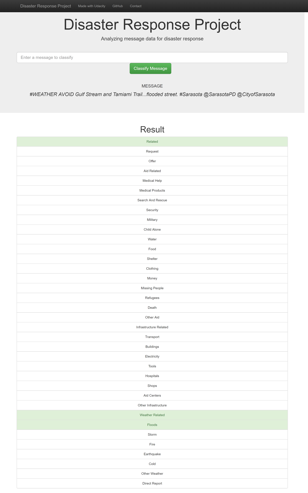
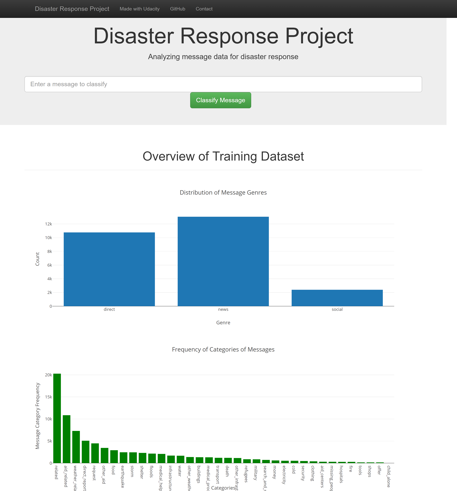

# Disaster Response Pipeline Project

## 1. Installation

I used python 3.6 and the librariesare:

nltk==3.4
numpy==1.15.4
pandas==0.23.4
plotly==3.4.2
scikit-learn==0.20.2
scipy==1.2.0
sklearn==0.0
SQLAlchemy==1.2.15

## 2. Project Motivation

Project code is deployed a program as a web application which is part of the Udacity Data Scientist Nanodegree program. The project uses Tweets and SMS's from real live disaster situations that have been collected and labelled by Figure Eight. The data is analyzed to build a model for an API that classifies disaster messages.

A machine learning pipeline to label these and new messaages into the appropiate categories in order to foward each message to an appropriate agency/department to handle the situation. The data is first divided into a training and a test set, then, a machine learning pipeline that uses NLTK, scikit-learn and GridSearchCV to produce a final model that is saved as a pickle file.

The web application uses bootstap and Flask. There, an emergency worker can input a new message and get it labeled for several categories.

Also, the application displays visualizations for the data:

## 3. File Descriptions

- \
	- README.md
	- ETL_Pipeline Preparation.ipynb
	- ML:Pipeline Preparation.ipynb
	- LICENSE.txt.
- \app
	- run.py
	- \templates
	   - go.html
	   - master.html
- \data
	- DisasterResponse.db
	- disaster_categories.csv
	- disaster_messages.csv
	- process_data.py
- \models
	- classifier.pkl The file can be downloaded from [here](https://cloud.insoft.es/s/NdHtSL7cRKGFM7d)
	- train_classifier.py

## 4.Instructions:

     1. Run the following commands in the project's root directory to set up your database and model.

         - To run ETL pipeline that cleans data and stores in database
             `python data/process_data.py data/disaster_messages.csv data/disaster_categories.csv data/DisasterResponse.db`
         - To run ML pipeline that trains classifier and saves
             `python models/train_classifier.py data/DisasterResponse.db models/classifier.pkl`

     2. Run the following command in the app's directory to run your web app.
         `python run.py`

     3. Go to http://0.0.0.0:3001/
